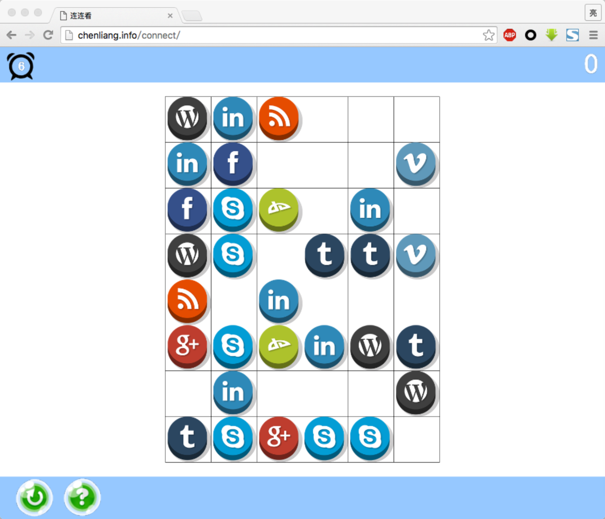

# connect2
Connect all the matching tiles! 

  

 

This is a sample game project to try out using javascript as the development language for the famous coco2dx engine.

I also have a C++ implementation <a href="github.com/newcl/connect">HERE</a>.

Conclusion:
Pros:
<ol>
  <li>
  javascript does speedup the dev process and reduce the maintenance cost
  </li>
  <li>
  you can promote your product more efficiently since you can share a link where the game is deployed and that's it, also the key factor for me to try out the javascript binding 
  </li>
</ol>
Cons:
<ol>
  <li>
  There seems to be browser compatability issues especially with the sound but I think this can improve over time
  </li>
</ol>
